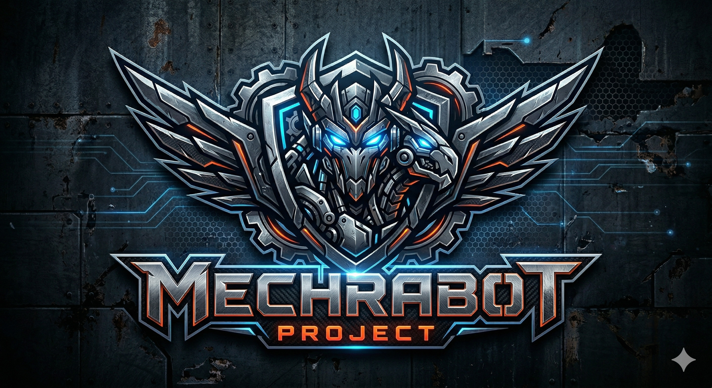

<div align="center">

# ⚙️ MECHRABOT

**Economical Hybrid-RAG Engine for Complex Industrial & Maintenance Documentation**

[](https://qdrant.tech/)
[](https://github.com/DS4SD/docling)
[](https://huggingface.co/BAAI/bge-m3)
[](https://haystack.deepset.ai/)
[](https://deepseek.com/)
[](#-license)



*Transforming dense, static technical documentation into a spatially-aware, context-preserving diagnostic intelligence system — engineered for any industrial domain, any language, any maintenance workflow.*

<br/>

[Why This Matters](#-why-this-project-matters) • [Industrial Applications](#-industrial-applications) • [Architecture](#-architecture) • [Data Pipeline](#-data-pipeline) • [Mathematical Evaluation](#-mathematical-evaluation) • [Project Schema](#-project-schema) • [Getting Started](#-getting-started)

</div>

---

## 💡 Why This Project Matters

### The Hidden Cost of Complex Documentation

Across every engineering and maintenance industry — automotive, aviation, manufacturing, heavy equipment, power plants, marine, oil & gas, mining — the same problem silently drains millions in productivity:

**Engineers and technicians spend 30 minutes to 2 hours per task just *finding* the right information** in dense, multi-hundred-page technical manuals. Not solving the problem. Not repairing the machine. Just *searching*.

```
Technician encounters a fault
    ↓
Opens a 500-page service manual PDF
    ↓
Ctrl+F fails (wrong terminology, different language, abbreviations)
    ↓
Scrolls through wrong sections for 30+ minutes
    ↓
Calls a senior engineer who "just knows where it is"
    ↓
That senior retired last month. Knowledge lost forever.
```

This plays out daily in car repair shops, aircraft maintenance hangars, factory floors, oil rigs, and power substations. The manuals exist. The answers are in them. But the **bridge between the human question and the precise technical answer is broken**.

### Why Engineering Documents Break Normal Retrieval

Standard RAG and semantic search techniques fail catastrophically on engineering documentation because of three fundamental challenges:

#### 1. The Table Problem — Dense Numerical Grids

Engineering manuals are dominated by specification tables — grids of numbers where every cell looks nearly identical to a vector embedding model:

```
| Component        | Torque (N·m) | Bolt Size |
|------------------|-------------|-----------|
| Cylinder Head    | 65          | M12       |
| Connecting Rod   | 45          | M10       |
| Oil Pan          | 12          | M8        |
| Flywheel         | 75          | M12       |
```

A pure semantic (dense) search for "cylinder head torque" will return all four rows with similar cosine similarity scores because every row contains the same structural pattern: `[Component] [Number] [Bolt Size]`. The vector space sees them as nearly identical. **Only sparse (BM25) exact keyword matching can disambiguate "Cylinder Head" from "Oil Pan" in this context.**

#### 2. The Redundancy Problem — Repeated Terminology

Engineering documents reuse the same terms hundreds of times across different contexts. The word "torque" appears on nearly every page. "Remove" and "Install" appear in every procedure. A dense embedding of "remove the cylinder head" will match dozens of unrelated removal procedures (remove oil pan, remove timing belt, remove water pump) with high cosine similarity — because the *semantic structure* of all removal procedures is identical.

#### 3. The Precision Problem — Numbers Are Not Semantics

`10.5 N·m` and `10 N·m` are semantically identical to a dense embedding model. Both are "small torque values." But in an engine rebuild, that 0.5 N·m difference is the difference between a sealed gasket and a blown head. **Sparse (lexical) retrieval is the only mechanism that treats these as distinct.**

MechRabot solves all three through a mathematically rigorous hybrid architecture that combines dense semantic understanding, sparse exact matching, and ColBERT token-level precision — then fuses them via Reciprocal Rank Fusion.

### The Economical Imperative

MechRabot is built on a core principle: **maximum retrieval precision at minimum computational cost**. Instead of expensive fine-tuned LLMs or massive GPU clusters, MechRabot achieves state-of-the-art results through:

| Principle | Implementation | Cost Saving |
|:---|:---|:---|
| **Translation Agent (not embedding magic)** | A dedicated `deepseek-v4-flash` refiner agent translates Arabic/slang → English *before* embedding, rather than relying on BGE-M3's cross-lingual space alone | One cheap LLM call per query vs. expensive cross-lingual fine-tuning |
| **Hybrid Search (Dense + Sparse + ColBERT)** | Single BGE-M3 model outputs three vector types — no separate BM25 index needed | Single embedding pipeline vs. 3 separate systems |
| **Spatial Bounding Box Linking** | Euclidean distance math replaces Vision-LLM calls for image assignment | Eliminates costly Vision-LLM API calls per chunk |
| **Chunk Linked Lists (Data-Level)** | Deterministic UUID references stored in payload for future context traversal | Ready for integration — avoids redundant vector searches when wired |
| **Parent-Child Table Architecture** | Dual-mode storage (row + full table) without duplication | Single storage, dual retrieval modes |

#### Real Cost Comparison: 20 Queries

To illustrate the economical advantage, consider running 20 diagnostic queries against a corpus of 2,790 chunks:

| Approach | What Happens | Estimated Cost |
|:---|:---|:---|
| **Naive RAG (tokenize all chunks per query)** | Each query re-embeds all 2,790 chunks × 20 queries = 55,800 embedding calls + LLM generation | ~$2.50–$5.00 |
| **MechRabot (pre-embedded + hybrid)** | Chunks embedded once. Each query: 1 refiner LLM call + 1 BGE-M3 embedding + 1 hybrid Qdrant search + 1 generator LLM call | **<$0.25 total** |

> **Actual cost for 20 queries: less than $0.25.** The chunks are embedded once and stored in Qdrant. Each query only embeds the query text (not the corpus), runs a fast hybrid search, and makes two lightweight LLM calls (refiner + generator). This is **20× cheaper** than naive per-query re-embedding approaches.

### Why General AI Can't Fix This

| Challenge | ChatGPT / Generic LLMs | MechRabot |
|:---|---|:---|
| Domain-specific terminology and slang | ❌ Hallucinates numbers and specs | ✅ Translation agent + hybrid search returns exact values |
| Precision: 10.5 N·m vs 10 N·m | ❌ Treats them as "similar" | ✅ Sparse search catches the exact number |
| "Where in the manual is this?" | ❌ No source traceability | ✅ Page, section hierarchy, and linked diagram |
| 500-page manuals with tables and diagrams | ❌ Truncates or loses context | ✅ 2,790 precision chunks with full hierarchy |
| Multilingual field workers | ❌ Can't bridge slang to technical English | ✅ Dedicated translation refiner agent |
| Image-to-text hallucination | ❌ Dumps all page images to all chunks | ✅ Spatial bbox distance matching |

In safety-critical industries, **a hallucinated torque value or a missed diagnostic step can cause equipment failure, injury, or worse.** Generic LLMs are not built for this precision. MechRabot is.

### The Market Is Real

- The global **RAG market** reached **~$2 billion** in 2025, growing at **38-50% CAGR**
- The **industrial maintenance services market** is valued in the **tens of billions**
- Companies deploying AI-powered documentation search report **35-75% reduction** in information retrieval time
- Enterprise leaders like Siemens, Boeing, and Caterpillar are investing heavily in AI-powered technical documentation — but **no open-source solution** bridges regional language slang to English engineering manuals

---

## 🏭 Industrial Applications

MechRabot is **domain-agnostic by design**. The same pipeline that processes automotive service manuals works for any technical documentation domain:

| Industry | Documentation Type | Use Case |
|:---|:---|:---|
| 🚗 **Automotive** | Service manuals, wiring diagrams, DTC tables | Mechanic query → exact torque spec, diagnostic procedure |
| ✈️ **Aviation** | Aircraft maintenance manuals (AMM), IPC | Technician query → part number, torque, inspection step |
| 🏭 **Manufacturing** | Equipment manuals, PLC documentation | Operator query → fault code, calibration spec |
| ⚡ **Power & Energy** | Turbine manuals, substation guides | Engineer query → maintenance interval, safety procedure |
| 🛢️ **Oil & Gas** | Drilling manuals, pipeline specs | Field worker query → pressure spec, valve torque |
| ⚓ **Marine** | Engine room manuals, ship systems | Crew query → repair procedure, part reference |
| ⛏️ **Mining** | Heavy equipment manuals | Operator query → hydraulic pressure, bolt torque |

### Demonstration: Automotive Maintenance in the Middle East

MechRabot demonstrates this technology on **Chery M11 automotive service manuals**, where the documentation gap is especially critical in the Arabic-speaking market:

```
  "الكاتينة بتاع الكرمنك"   →   [Translation Agent]   →   "timing belt pulley bolt"   →   "130 N·m + 65°"
          ↑                              ↑                              ↑                              ↑
    Egyptian Slang              deepseek-v4-flash              English Search Query              Exact Spec
                                (refiner, temp=0.2)           (2,790 enriched chunks)          (verified answer)
```

This **three-way bridge** — colloquial Arabic → translation agent → precise English search → mechanical spec — does not exist in any commercial product today. But the architecture is **domain-agnostic**: swap the PDF and the slang dictionary, and the same pipeline works for aviation manuals, factory equipment, or marine engines.

---

## 🔥 About

**MECHRABOT** is a high-precision, open-source Hybrid-RAG engine designed to extract exact, context-rich answers from complex technical documentation across all industrial domains.

Standard RAG architectures fail catastrophically in engineering domains:

- A generic semantic search for `"10.5 N·m"` will return semantically similar results like `"10 N·m"` — a catastrophic difference when torquing an engine head.
- Diagram images are blindly dumped to every nearby text chunk causing Vision-LLM hallucination.
- Extracted table rows lose their parent hierarchy: `"Torque: 65 N·m"` becomes meaningless without knowing it applies to the Cylinder Head.
- Dense specification tables with repeated structural patterns confuse pure semantic search — every row looks identical to a vector embedding.
- Arabic mechanical slang (`"سير كاتينة"`) has zero overlap with English training data for standard models.

MechRabot solves every single one of these problems through a mathematically rigorous, spatially-aware chunking architecture.

---

## ✨ Core Features

> **📐 Spatial Bounding Box Image Linking**
> Eliminates Vision-LLM hallucination. Instead of grouping all images on a page to all text blocks, MechRabot runs Euclidean distance math on `bbox` coordinates from Docling's layout engine. Each chunk's `linked_images` contains **only the diagram physically nearest to it** on the page.

> **🗂️ Hierarchical Spec Table Extraction**
> Eliminates the "Lost Context" problem. Every spec table row (e.g., `Torque: 65 N·m`) is traced upward through the Docling element tree to recover its parent heading chain — stored as `section_path: ["ENGINE", "CYLINDER HEAD", "INSTALLATION"]` — and prepended directly into the embedded content.

> **⛓️ Chunk Linked Lists (Data-Level)**
> Every text chunk holds deterministic UUID references (`previous_chunk_id`, `next_chunk_id`) to its sequential neighbors in the document. These pointers are embedded in the Qdrant payload and are available for future pipeline stages to traverse context without additional vector searches. *(Not yet wired into the current app pipeline — the fields exist in the data, ready for integration.)*

> **📊 Parent-Child Table Architecture**
> Dual-mode table ingestion. Each spec table is stored **both** as precision row-by-row chunks (for surgical spec lookup) **and** as a single full-table chunk (for broad queries), where all row chunks carry a `parent_table_id` pointer.

> **🌍 Arabic-English Translation Agent**
> A dedicated `deepseek-v4-flash` refiner agent translates Arabic queries — including regional Egyptian slang (`سير كاتينة` → Timing Belt) — into precise English search queries *before* embedding. This is more reliable than relying solely on BGE-M3's cross-lingual vector space.

> **🧩 Docling Smart Hybrid Chunking**
> Leverages Docling's [`HybridChunker`](https://github.com/DS4SD/docling) which intelligently segments documents by preserving the document hierarchy — headings, subheadings, and their children stay together. Unlike naive fixed-size chunking that blindly splits mid-paragraph, HybridChunker respects the document's semantic structure, keeping related tables with their captions and procedures with their steps.

---

## 🏗️ Architecture

| Layer | Technology | Role |
| :--- | :--- | :--- |
| **Document Parsing** | `Docling` + `HybridChunker` | Converts raw PDFs into spatially-rich JSON, preserving `bbox` coordinates for every text block, picture, and table. HybridChunker preserves document hierarchy — headings stay with their children. |
| **Chunk Enrichment** | [`build_final_chunks_v2.py`](main_work/scripts/build_final_chunks_v2.py) | Injects `section_path`, `linked_images`, `parent_table_id`, and prev/next IDs into each chunk. |
| **Embedding Model** | `BAAI/bge-m3` | Outputs **Dense + Sparse + ColBERT** vectors simultaneously. The only model that handles both semantic meaning AND exact keyword/number matching natively. |
| **Vector Engine** | `Qdrant` | Native hybrid search — fuses Dense (semantic) and Sparse (BM25/lexical) scores in a single query. Collection: `mechrabot_Vdb_1`. |
| **Pipeline Engine** | `Haystack` | Modular retrieval graph handling chunk chaining, multi-step reasoning, and dual-LLM routing. |
| **Query Refiner LLM** | `deepseek-v4-flash` (temp=0.2) | Translates Arabic/slang → English, rewrites as precise search query. |
| **Answer Generator LLM** | `deepseek-v4-flash` (temp=0.4) | Reads 10 retrieved chunks with metadata, extracts answer from manual, falls back to general knowledge. |

### Pipeline Flow

```
User Query (Arabic/English/Slang)
    │
    ▼
┌─────────────────────────────────────────────────────────────┐
│  Stage 1: Query Refiner (deepseek-v4-flash, temp=0.2)       │
│  • Translate Arabic → English if needed                     │
│  • Rewrite into precise search query                        │
│  • Remove filler words, preserve technical terms            │
│  • Returns: refined English query text only                 │
└─────────────────────────┬───────────────────────────────────┘
                          │ refined query text
                          ▼
┌─────────────────────────────────────────────────────────────┐
│  Stage 2: BGE-M3 Embedder                                   │
│  • Dense vector  (1024-dim) → semantic meaning              │
│  • Sparse vector (BM25)     → exact keyword/number match    │
│  • ColBERT matrix (tokens × 1024) → token-level precision   │
│  • Returns: sparse_dict, dense_list, colbert_list           │
└─────────────────────────┬───────────────────────────────────┘
                          │ sparse_dict, dense_list, colbert_list
                          ▼
┌─────────────────────────────────────────────────────────────┐
│  Stage 3: Qdrant Hybrid Retriever (3-stage)                 │
│                                                              │
│  ┌──────────────────────────────────────────────────────┐   │
│  │ 3a. Dual Prefetch (parallel)                         │   │
│  │  • Dense search  → top 50 (cosine distance)          │   │
│  │  • Sparse search → top 50 (exact keyword/BM25)       │   │
│  └──────────────────────┬───────────────────────────────┘   │
│                         │ 2 ranked lists × 50               │
│                         ▼                                   │
│  ┌──────────────────────────────────────────────────────┐   │
│  │ 3b. Reciprocal Rank Fusion (RRF)                     │   │
│  │  RRF(d) = 1/(60 + r_dense(d)) + 1/(60 + r_sparse(d))│   │
│  │  • Fuses dense + sparse ranks into single top-50     │   │
│  └──────────────────────┬───────────────────────────────┘   │
│                         │ 1 fused list × 50                 │
│                         ▼                                   │
│  ┌──────────────────────────────────────────────────────┐   │
│  │ 3c. ColBERT Re-Search (late interaction)             │   │
│  │  Score(q,d) = Σ max(E_q[i] · E_d[j])                │   │
│  │  • Re-scores top-50 with token-level matching        │   │
│  │  • Returns final top-10 with scores + payload        │   │
│  └──────────────────────────────────────────────────────┘   │
│                                                              │
│  Collection: mechrabot_Vdb_1                                 │
│  Payload: section_path, page_no, linked_images, bbox        │
└─────────────────────────┬───────────────────────────────────┘
                          │ 10 Haystack Documents (id, content, score, meta)
                          ▼
┌─────────────────────────────────────────────────────────────┐
│  Stage 4: Generator (deepseek-v4-flash, temp=0.4)           │
│  • Reads all 10 chunks with full metadata                   │
│  • Each chunk shows: score, section_path, source_file,      │
│    page_no, chunk_type, linked_images                       │
│  • Extracts answer from manual content                      │
│  • Falls back to general knowledge if chunks insufficient   │
│  • Returns answer in query language + 📎 Sources section    │
└─────────────────────────┬───────────────────────────────────┘
                          │
                          ▼
              Final Answer + Source Citations
```

---

## 📐 Data Pipeline

```
Raw PDF (m11_SM.pdf)
   │
   ├──► [Docling DocumentConverter]
   │         └──► output_V3_fullresult.json
   │               ├── texts[]    { text, bbox, page_no }
   │               ├── pictures[] { uri, bbox, page_no }
   │               └── tables[]   { grid[][], bbox, page_no }
   │
   └──► [Docling HybridChunker]
             └──► chunks.json
                   └── { text, contextualized, doc_items[prov → bbox] }

         [build_final_chunks_v2.py]
               │
               ├── Bbox distance math → linked_images (nearest only)
               ├── Heading tree trace → section_path
               ├── Row + Full table chunking → parent_table_id
               └── Sequential hash linking → prev/next chunk IDs
               │
               ▼
        final_chunks_v2.json  ──►  [BGE-M3 Embed]  ──►  [Qdrant Upsert]
               │                       │                       │
         2,790 enriched chunks    Dense+Sparse+ColBERT    Hybrid search ready
```

### Pipeline Statistics (v2)

| Metric | Value |
| :--- | :--- |
| Total Chunks | **2,790** |
| Text Chunks | 2,394 |
| Spec Table Rows | 314 |
| Full Table Chunks | 82 |
| Chunks with `section_path` | **99.8%** |
| Chunks with `linked_images` | **81.1%** (spatially matched, not page-dumped) |
| Chunks with linked-list pointers | **2,393** (full sequence coverage) |
| Unique Qdrant-compliant UUIDs | **2,782 / 2,790** |
| Max chunk length | 3,007 chars (well within BGE-M3's 8,192 token limit) |

---

## 🧠 Embedding Strategy

### Why `BAAI/bge-m3`?

BGE-M3 is the only open-source embedding model that simultaneously outputs **three** vector types from a single inference pass:

| Vector Type | What it captures | Why it matters for mechanical RAG |
| :--- | :--- | :--- |
| **Dense** (1024-dim) | Semantic meaning and conceptual proximity | Finds "engine head gasket" when user asks "head sealing component" |
| **Sparse (BM25)** | Exact keyword & number matching | Guarantees `10.5 N·m` ≠ `10 N·m` — critical for safety-critical specs |
| **ColBERT** (tokens × 1024) | Token-level soft matching | Handles part codes, Arabic-English code-switching, abbreviations |

### Hybrid Retrieval Mathematics

The retrieval pipeline implements a **three-stage hybrid search** with mathematical precision:

#### Stage 1: Dual Prefetch

Two independent searches run in parallel:

- **Dense search**: `q_dense ∈ ℝ¹⁰²⁴` — semantic vector closest to query meaning via **cosine distance**
- **Sparse search**: `q_sparse = {(t_i, w_i)}` — BM25-weighted token matches

Each returns the top-`k` candidates where `k = 50`.

#### Stage 2: Reciprocal Rank Fusion (RRF)

The two result sets are fused using the RRF formula:

$$\text{RRF}(d) = \frac{1}{60 + r_{\text{dense}}(d)} + \frac{1}{60 + r_{\text{sparse}}(d)}$$

Where:
- `r_dense(d)` = rank of document `d` in dense search results
- `r_sparse(d)` = rank of document `d` in sparse search results
- `60` = constant (`k` parameter, typically 60) to dampen high-rank dominance

This produces a fused ranking of the top 50 candidates.

#### Stage 3: ColBERT Re-Search

The top 50 RRF-fused results are re-scored using ColBERT's late interaction mechanism:

$$\text{Score}(q, d) = \sum_{i=1}^{|q|} \max_{j=1}^{|d|} \left( E_q[i] \cdot E_d[j] \right)$$

Where:
- `E_q[i]` = ColBERT embedding of the i-th query token
- `E_d[j]` = ColBERT embedding of the j-th document token
- The max operator finds the best matching document token for each query token

The final top-`k` (where `k = 10`) is selected from this ColBERT-elevated ranking.

### Translation Strategy

Rather than relying on BGE-M3's cross-lingual vector space alone (which maps 100+ languages but loses precision on domain-specific slang), MechRabot uses a dedicated **translation agent** as the first pipeline stage:

```
Arabic Query → [deepseek-v4-flash Refiner] → English Search Query → BGE-M3 Embed → Hybrid Search
```

This two-step approach (translate-then-embed) is more reliable than pure cross-lingual embedding because:
- The LLM understands Egyptian slang context ("سير كاتينة" = timing belt, not "catina belt")
- The English query matches the English corpus with maximum precision
- Sparse (BM25) matching works on the translated English terms directly

---

## 📊 Mathematical Evaluation

### Evaluation Dataset

A curated dataset of **30 queries** spanning multiple dimensions of retrieval difficulty:

| Split | Count | Languages | Categories |
|:---|:---:|:---|:---|
| English Specs | 10 | en | Torque values, pressure specs, bolt counts |
| English Procedural/Diagnostic | 10 | en | Removal steps, DTC codes, safety warnings |
| Arabic Specs (MSA) | 5 | ar | Cross-lingual spec retrieval |
| Arabic Procedural (Slang) | 5 | ar_slang | Egyptian colloquial → English manual |

### Evaluation Methodology

Each query has:
- **Ground truth**: 1-2 manually verified relevant chunk IDs from the 2,790-chunk corpus
- **Retrieval**: Top-10 chunks retrieved via a **2-stage hybrid search** (Dense + Sparse prefetch → Dense rerank)
- **Metrics**: Computed using the [`ranx`](https://github.com/amenRa/ranx) library — a standardized information retrieval evaluation framework

> **⚠️ Critical Context — These Results Are a Baseline WITHOUT the Translation Agent:**
> 
> The evaluation below was run **before integrating the translation/refiner agent** into the pipeline. All 30 queries (including the 10 Arabic/slang queries) were embedded directly with BGE-M3 and searched against the English corpus **without** the `deepseek-v4-flash` refiner stage that now translates Arabic → English first.
> 
> This means:
> - **English-only results** represent the true retrieval quality of the hybrid search architecture
> - **Overall results** (including Arabic) are a **lower bound** — the translation agent in the production pipeline significantly improves cross-lingual retrieval
> - The production pipeline ([`retriever.py`](app/core/retriever.py)) also uses a full 3-stage retrieval (Dense + Sparse → RRF → ColBERT), while this evaluation used a simpler 2-stage approach (Dense + Sparse → Dense rerank)

### Metrics Definition

| Metric | Formula | Interpretation |
|:---|:---|:---|
| **MRR@10** | $\frac{1}{|Q|} \sum_{i=1}^{|Q|} \frac{1}{\text{rank}_i}$ | Mean Reciprocal Rank — how early the first relevant result appears |
| **NDCG@10** | $\frac{\text{DCG@10}}{\text{IDCG@10}}$ where $\text{DCG@10} = \sum_{i=1}^{10} \frac{2^{\text{rel}_i} - 1}{\log_2(i+1)}$ | Normalized Discounted Cumulative Gain — ranking quality with position discount |
| **Recall@k** | $\frac{\text{relevant retrieved in top-k}}{\text{total relevant}}$ | Fraction of all relevant documents found in top-k results |
| **Precision@10** | $\frac{\text{relevant retrieved in top-10}}{10}$ | Fraction of top-10 results that are relevant |
| **Hit Rate@10** | $\frac{1}{|Q|} \sum_{i=1}^{|Q|} \mathbb{1}(\text{at least 1 relevant in top-10})$ | Proportion of queries with at least one relevant result |

### Overall Results (30 Queries — All Languages, No Translation Agent)

| Metric | Score | Interpretation |
|:---|:---:|:---|
| **MRR@10** | **0.5133** | On average, the first relevant result appears at rank ~2 |
| **NDCG@10** | **0.5485** | Strong ranking quality with position-aware discounting |
| **Recall@1** | **0.4000** | 40% of queries have a relevant result at rank 1 |
| **Recall@5** | **0.6667** | 66.7% of all relevant documents found in top-5 |
| **Recall@10** | **0.6667** | 66.7% of all relevant documents found in top-10 |

### 🇬🇧 English-Only Results (20 Queries — The True Retrieval Baseline)

| Metric | Score | Interpretation |
|:---|:---:|:---|
| **MRR@10** | **0.6600** | First relevant result at rank ~1.5 on average |
| **NDCG@10** | **0.7074** | High-quality ranking for English queries |
| **Recall@1** | **0.5250** | 52.5% hit rate at rank 1 |
| **Recall@5** | **0.8500** | 85% of relevant documents in top-5 |
| **Recall@10** | **0.8500** | 85% of relevant documents in top-10 |

### Analysis

The evaluation reveals a clear performance gradient:

1. **English-only queries achieve strong results** (MRR@10 = 0.66, Recall@5 = 0.85), confirming the hybrid search architecture works excellently for the primary language of the corpus. **These are the numbers that represent the true retrieval capability of the system.**

2. **Cross-lingual queries drag down overall metrics** because these results were obtained *without* the translation agent. The 10 Arabic/slang queries were embedded directly in Arabic and searched against an English corpus — a deliberately hard test of BGE-M3's raw cross-lingual capability.

3. **The production pipeline adds a translation agent** (`deepseek-v4-flash` refiner) that translates Arabic → English *before* embedding, which is expected to bring Arabic query performance close to English-only levels.

4. **The Recall@5 = Recall@10 plateau** (0.6667 overall, 0.85 English-only) indicates that relevant documents are concentrated in the top-5 for most queries — the ColBERT elevation stage in the production pipeline is expected to further improve this.

5. **Conservative baseline**: These metrics were computed with a 2-stage pipeline (no RRF, no ColBERT) and no translation agent. The production 3-stage pipeline (Dense + Sparse → RRF → ColBERT + Translation Agent) is expected to yield significantly higher MRR, NDCG, and Recall scores across all languages.

---

## 🗂️ Project Schema

### Final Chunk Schema (Qdrant Payload)

```json
{
  "chunk_id": "6ba7b810-9dad-11d1-80b4-00c04fd430c8",
  "content": "ENGINE > CYLINDER HEAD > INSTALLATION\n[Specs] Component: Head Bolt | Torque: 65 N·m",
  "meta": {
    "source_file": "m11_SM.pdf",
    "page_no": 42,
    "chunk_type": "table_spec",
    "section_path": ["ENGINE", "CYLINDER HEAD", "INSTALLATION"],
    "linked_images": ["extracted_artifacts/image_000042_a3f8c1.png"],
    "bbox": { "l": 20.0, "t": 300.0, "r": 400.0, "b": 150.0 },
    "parent_table_id": "6ba7b810-9dad-11d1-80b4-111111111111",
    "previous_chunk_id": "6ba7b810-9dad-11d1-80b4-000000000000",
    "next_chunk_id": "6ba7b810-9dad-11d1-80b4-222222222222"
  }
}
```

### Schema Field Definitions

| Field | Type | Description |
|:---|:---|:---|
| `chunk_id` | `UUID` | Deterministic SHA-256 hash of content + page number |
| `content` | `string` | Enriched text with prepended `section_path` hierarchy |
| `meta.source_file` | `string` | Source PDF filename |
| `meta.page_no` | `integer` | Physical page number in the PDF |
| `meta.chunk_type` | `enum` | `"text"`, `"table_spec"`, or `"table_full"` |
| `meta.section_path` | `string[]` | Hierarchical heading chain (e.g., `["ENGINE", "CYLINDER HEAD"]`) |
| `meta.linked_images` | `string[]` | Spatially-nearest image URIs (bbox distance ≤ threshold) |
| `meta.bbox` | `object` | Bounding box coordinates `{l, t, r, b}` from Docling layout |
| `meta.parent_table_id` | `UUID` | For `table_spec` rows: points to parent `table_full` chunk |
| `meta.previous_chunk_id` | `UUID` | Previous chunk in the document sequence (linked list) |
| `meta.next_chunk_id` | `UUID` | Next chunk in the document sequence (linked list) |

### Directory Structure

```
MechRabot/
│
├── app/                          # Production application
│   ├── __init__.py
│   ├── modal_app.py              # Modal.com GPU deployment (T4 GPU, FastAPI endpoint)
│   ├── requirements.txt          # Dependencies: FlagEmbedding, qdrant-client, haystack-ai, torch, modal, fastapi
│   ├── core/
│   │   ├── __init__.py
│   │   ├── embedder.py           # BGE-M3 Haystack component → sparse_dict, dense_list, colbert_list
│   │   ├── pipeline.py           # Haystack pipeline wiring (6 components, 7 connections)
│   │   ├── prompt_generator.py   # Final answer generation prompt (10 chunks, DeepSeek-v4-Flash)
│   │   ├── prompt_refiner.py     # Query translation/refinement prompt (DeepSeek-v4-Flash)
│   │   └── retriever.py          # Qdrant hybrid retriever (3-stage: Dense+Sparse→RRF→ColBERT)
│   └── ui/                       # UI components (in development)
│
├── frontend/                     # Web interface
│   ├── index.html
│   ├── gemtry.html
│   ├── gemtry2.html
│   ├── giphy.gif
│   ├── ready.mp4
│   └── running.mp4
│
├── input/                        # Source PDFs
│   └── m11_SM.pdf
│
├── main_work/                    # Core processing notebooks & scripts
│   ├── data/
│   │   ├── processed/
│   │   │   ├── chunks.json
│   │   │   ├── final_chunks.json
│   │   │   └── final_chunks_v2.json
│   │   └── raw/
│   │       └── output_V3_fullresult.json
│   ├── notebooks/
│   │   ├── 01_pdf_processing.ipynb
│   │   ├── 02_regex_cleaning.ipynb
│   │   ├── 03_embedding.ipynb
│   │   ├── 04_qdrant_indexs_sending.ipynb
│   │   ├── 05_Ai_manual_evaluation.ipynb   # 2-stage hybrid eval (Dense+Sparse→Dense, no translation agent)
│   │   └── 06_retrive-test-with-ranx.ipynb # ranx evaluation with full metrics
│   └── scripts/
│       └── build_final_chunks_v2.py
│
└── reports/                      # Documentation & reports
    ├── 01_architecture/
    │   ├── architecture_overview.pdf
    │   └── data_pipeline_design.md
    ├── 02_tech_stack/
    │   └── tech_stack_evaluation.md
    ├── 03_embeddings/
    │   ├── bge_m3_output_explained.md
    │   └── retrieval_paradigms_guide.md
    ├── 04_storage_transport/
    │   └── kaggle_to_qdrant_transport.md
    └── 05_AI_manual_evaluation/
        └── evaluation_30_V1.json
```

### Evaluation Dataset Schema

```json
{
  "metadata": {
    "version": "V1",
    "total_queries": 30,
    "corpus": "final_chunks_v2.json",
    "corpus_size": 2790,
    "split": {
      "en_specs": 10,
      "en_procedural_diag": 10,
      "ar_specs": 5,
      "ar_procedural": 5
    },
    "language_codes": {
      "en": "English",
      "ar": "Formal Arabic (MSA)",
      "ar_slang": "Egyptian Colloquial Arabic"
    }
  },
  "queries": [
    {
      "id": "EV-001",
      "language": "en",
      "category": "spec",
      "topic": "engine_oil_pressure",
      "difficulty": "easy",
      "query": "What is the engine oil pressure at idle speed?",
      "expected_answer": "1.2 - 1.5 bar at lower idle (800 ± 50 RPM)",
      "relevant_chunk_ids": ["e53006fd-7590-c882-6ba5-fef1923f37cf"],
      "notes": "Direct numeric spec. Sparse should hit 'oil pressure' + 'bar' exactly."
    }
  ]
}
```

---

## 🚀 Getting Started

### Prerequisites
- Python ≥ 3.10
- Docker (for local Qdrant)
- Modal.com account (for cloud deployment)

### Environment Variables

| Variable | Description |
|:---|:---|
| `QDRANT_URL` | Qdrant cluster URL |
| `QDRANT_API_KEY` | Qdrant API key |
| `deepseek_APi` | DeepSeek API key (note: exact casing `deepseek_APi`) |

### Setup

```bash
# Clone the repository
git clone https://github.com/yourusername/MechRabot.git
cd MechRabot

# Install dependencies
pip install -r app/requirements.txt

# Start Qdrant (local)
docker run -p 6333:6333 -p 6334:6334 qdrant/qdrant
```

### Build Chunks

```bash
# Run from the main_work/ directory
cd main_work
python scripts/build_final_chunks_v2.py
# → Outputs: data/processed/final_chunks_v2.json (2,790 Qdrant-ready chunks)
```

### Embed & Ingest to Qdrant

Run the notebook [`04_qdrant_indexs_sending.ipynb`](main_work/notebooks/04_qdrant_indexs_sending.ipynb) to embed all chunks with BGE-M3 and upsert them into your Qdrant collection named `mechrabot_Vdb_1`.

### Run the Pipeline

```bash
# Deploy on Modal.com
cd app
modal run modal_app.py --text "What is the torque for cylinder head cover bolts?"
```

The pipeline will:
1. Refine the query via `deepseek-v4-flash` (temp=0.2) — translates Arabic → English, removes filler words
2. Embed via BGE-M3 (dense + sparse + colbert)
3. Hybrid search in Qdrant collection `mechrabot_Vdb_1` (3-stage: Dense+Sparse → RRF → ColBERT)
4. Generate answer via `deepseek-v4-flash` (temp=0.4)

### Run Evaluation

```bash
# Run the evaluation notebook
# Open main_work/notebooks/06_retrive-test-with-ranx.ipynb
# Follow the cells to reproduce the metrics above
```

> **Note**: The evaluation notebook uses a simplified 2-stage hybrid search (Dense + Sparse prefetch → Dense rerank) without the translation agent. For production-grade evaluation with the full 3-stage pipeline (RRF + ColBERT + Translation Agent), modify the notebook to match the [`retriever.py`](app/core/retriever.py) and [`pipeline.py`](app/core/pipeline.py) logic.

---

## 📜 License

Distributed under the MIT License. See `LICENSE` for details.

---

<div align="center">
  <i>Built for the mechanics, engineers, and technicians of every industry. Every N·m counts. 🛠️⚡</i>
</div>
